# _alles_ gallery
diego domenzain
September 2020 @ Colorado School of Mines

For some reason, _Github_ does not like symbolic links in their webpage. So here is a dump of the pics.

---

## Optimization

#### Gedanken of joint inversion
[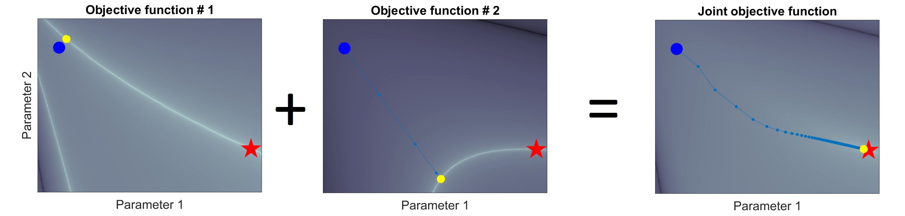](../projects/opti/gedanken/)
#### Gravity inversion

#### Cross-gradient inversion
[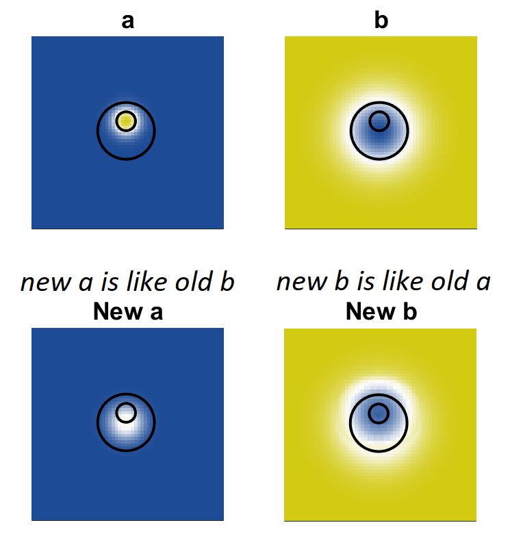](../projects/opti/xgrad/)
#### Logistic regression
#### Snow slip
#### Dense circle packing
[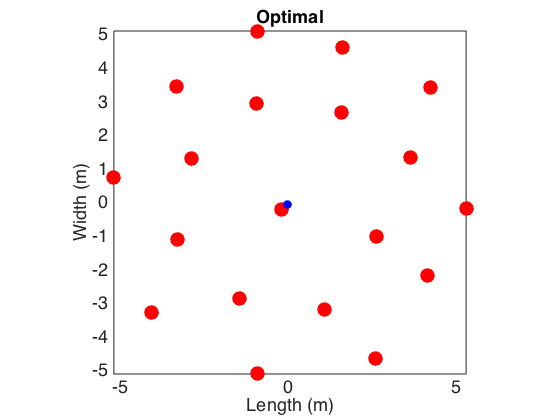](../projects/opti/dense-circ/)
#### Markowitz portfolio
#### Decision trees & Random forests
#### Bayesian optimization

## Dimensionality reduction

#### Self-organizing maps
#### t-SNE

## Graph theory algorithms

#### Spanning trees
#### Dijkstra algorithm
[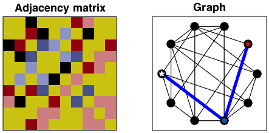](./)

## Partial differential equations

#### Wave-advection
[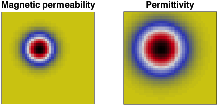](./)
	
[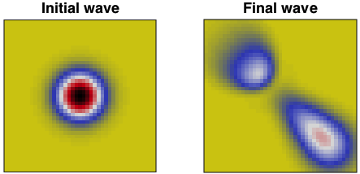](./)
#### Heat equation
[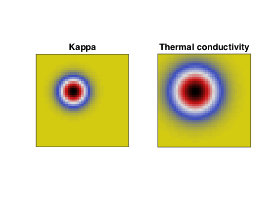](./)
	

#### Korteweg De Vries
[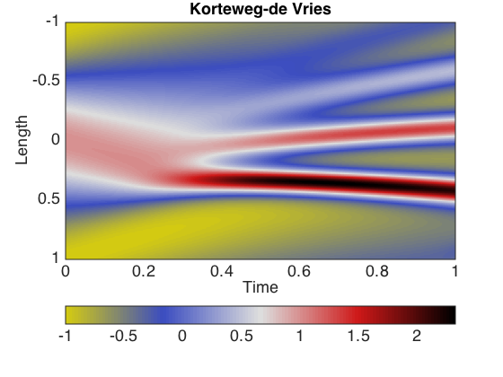](./)
#### Eikonal solver
[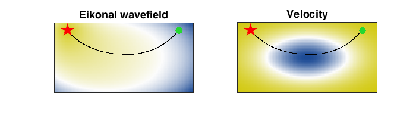](./)

## Squeezing and expanding matrices

#### Compressed sensing
#### Matrix completion
#### Pixelating pics (for face-recognition-free profile pics)
[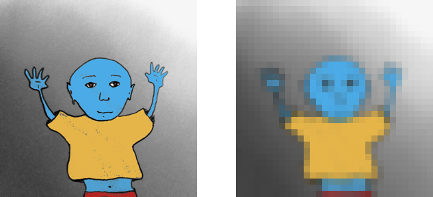](./)

## Wave processing

#### MASW
#### FTAN
#### STFT

#### Hyperbolic and linear semblance
#### Beamforming (to find direction of signal)
[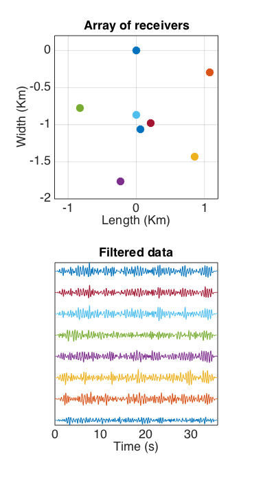](./)[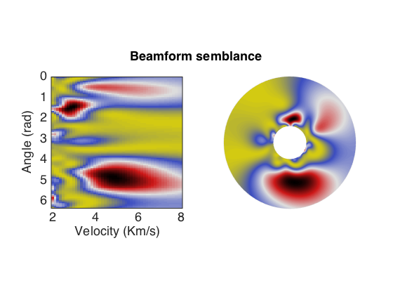](./)
### Seismic beachball
	
## Cloud computing

#### Slurm
#### AWS

