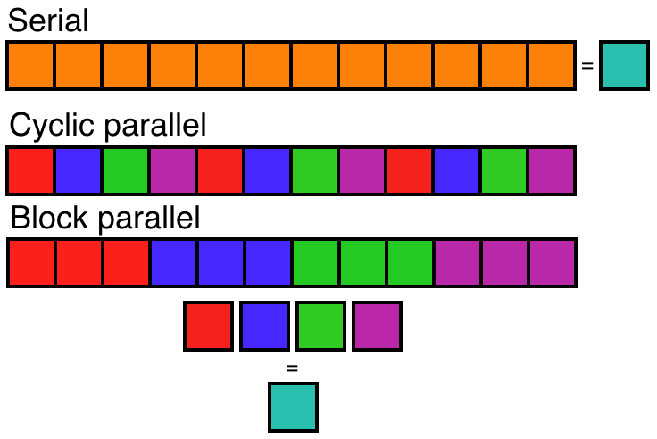

# OpenMP
diego domenzain

March 2021 @ Colorado School of Mines

## Implementation of OpenMP

Communicating with multiple processors (MP) using the openMP framework.

__These functions are examples on how to use openMP.__

[](./)

They are taken from the book [The openMP common core](https://mitpress.mit.edu/books/openmp-common-core). The book itself comes with code in *C* and *Fortran*. The code can be found [here](http://ompcore.com/) and [here](https://github.com/tgmattso/OmpCommonCore/tree/master/Book/).

---

This repo is just a way for me to learn this stuff. The code is to be compiled and run here in a simple way.

For *C*,
```shell
gcc -fopenmp file.c
./a.out
```

For *Fortran*,
```bash
gfortran -fopenmp file.f90
./a.out
```

My old Mac doesn't have openMP enabled for *C*.

*Fortran* is doing ok though. 

---

## Lessons learned

1. Concurrency: if you don't schedule right, the result will be scrambled. Solutions,
    * critical sections
    * barriers
1. *GPU*s prioritize __throughput__ rather than __latency__,
    * good for algorithms whose "workers" need little data interaction.
1. *CPU*s prioritize __latency__ rather than __throughput__.
1. Optimize code by
    * reorganizing loops to reuse data from cache lines (*cache blocking*),
    * initialize data on the same cores that will later process that data.
1. *MPI* between nodes, and *openMP* within a node.
1. *openMP* makes ```pthread.h``` simple.
1. Two different architectures,
    * *Symmetric Multiprocessor* (**SMP**).
    * *Non-uniform memory architecture* (**NUMA**).
1. *Simple program multiple data* (**SPMD**) design pattern:
    * Launch two or more threads that execute the same code.
    * Each thread determines its ID and the number of threads in the team.
    * Use the ID and the number of threads in the team to split up the work between threads.
