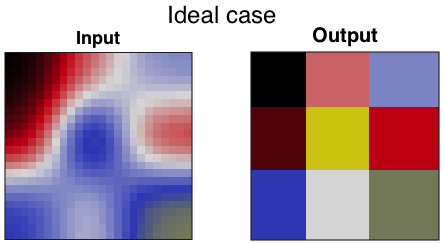
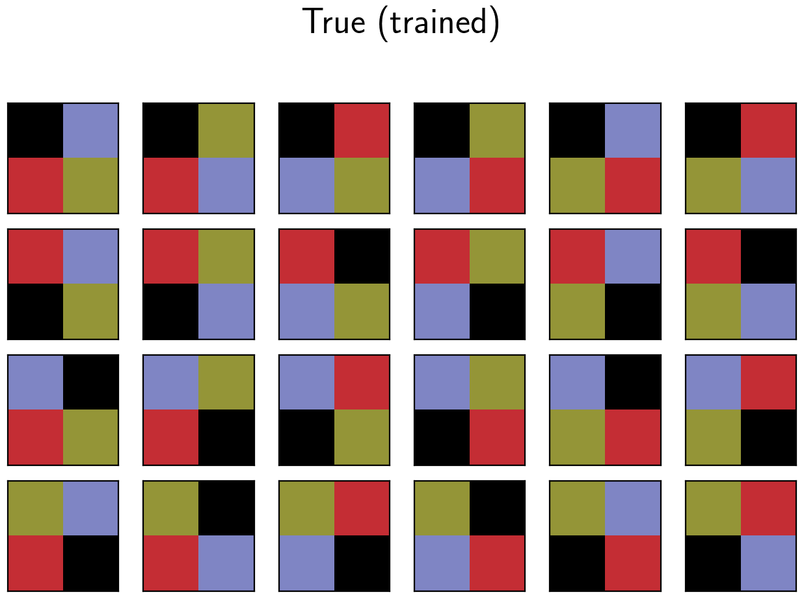

# pic2pic. Smooth to rough squares
diego domenzain
December 2020 @ Colorado School of Mines

[](./)

__This is an example of mapping smooth matrices to their rough equivalent.__

Deep learning architectures are __encoder-decoder__ and __generative adversarial networks__.

## Purpose

The purpose is to build __gradient boosters__ for a physics based inversion.

This project in itself is a proof of concept.

## Map smooth squares to rough squares

_Output_

* __For training__. 24x24 matrix sub-divided in 3x3 blocks, each of size 8x8.
   * Each block has as value a number between 1/9 and 1.
* __In practice__. As the input, but with added high spatial-frequency content.

_Input_

* __For training__. Smooth version of the _output_ matrix.
* __In practice__. A smooth image of something that should have higher spatial-frequency content.

## Problem set-up

1. Build 9! = 362,880 matrices, each of size 24x24 and sub-divided in 3x3 blocks, each block of size 8x8. Each block has as value a number between 1/9 and 1.

1. Smooth each of the 9! matrices of step __1__.

1. The __learning machine__ will map the matrices of step __2__ to those of step __1__.

## Mini suite

The ```mini``` suite is a mini version of the main version explained above, consisting of only 2x2 blocks - not 3x3 blocks.

We build 4! = 24 matrices.

## Code

* The script ```idea_ex.m``` just plots the idea of what should happen. No training or model generation here.

* ```pic_generator.m``` builds the training data: ```x, y = b_, b```.

* ```ml_encodeco.py``` loads data, optimizes, and saves the __encoder-decoder__ model.

* ```ml_gan.py``` loads data, optimizes, and saves the __GAN__ model.

* ```ml_journey.py``` plots the journey of one sample through the _learning machine_.

* ```ml_predict.py``` computes and saves all outputs of the training and testing set.

* ```ml_visualize.py``` plots the true, observed, and recovered pictures.

## Results

[](./)

[](./)

[](./)

[](./)

[](./)

---

__GAN__ architecture. 

When using the model for prediction, only the _generator_ (red lines) are activated.

[](./)

