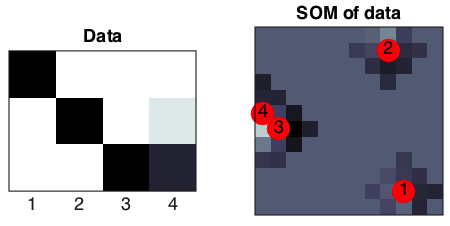

# Self-organizing maps
diego domenzain
September 2020 @ Colorado School of Mines

## Cluster n-dimensional data in two-dimensions

Given a data set in n-dimensions, how do we visualize it in our limited human vision?

__These scripts are examples of self-organizing maps.__

* ```synth_ex.m``` is a light-weight synthetic example.
 
* ```zodiac_ex.m``` uses data from one of those buzz-feed-type questionnaires but for a work environment.

  * Columns are the questions, rows are people.
  * Interesting trends:
    * Persons 1, 9, and 14 were the oldest ladies in the group.
    * Persons 2, 3, 4, (all dudes) and 8 were officemates.
    * Persons 5, 6, and 11 were the most boring in the group by far (all dudes).
    
* ```geoclasses_ex.m``` uses data from _geoscience_ students (not necessarily geo-__physicists__).
 
 * Columns are _classes_ they take, and rows are _attributes_ from those classes.
 * Interesting trends
  * ?

---

## Synthetic example

[](./)

## Zodiac example

[](./)

