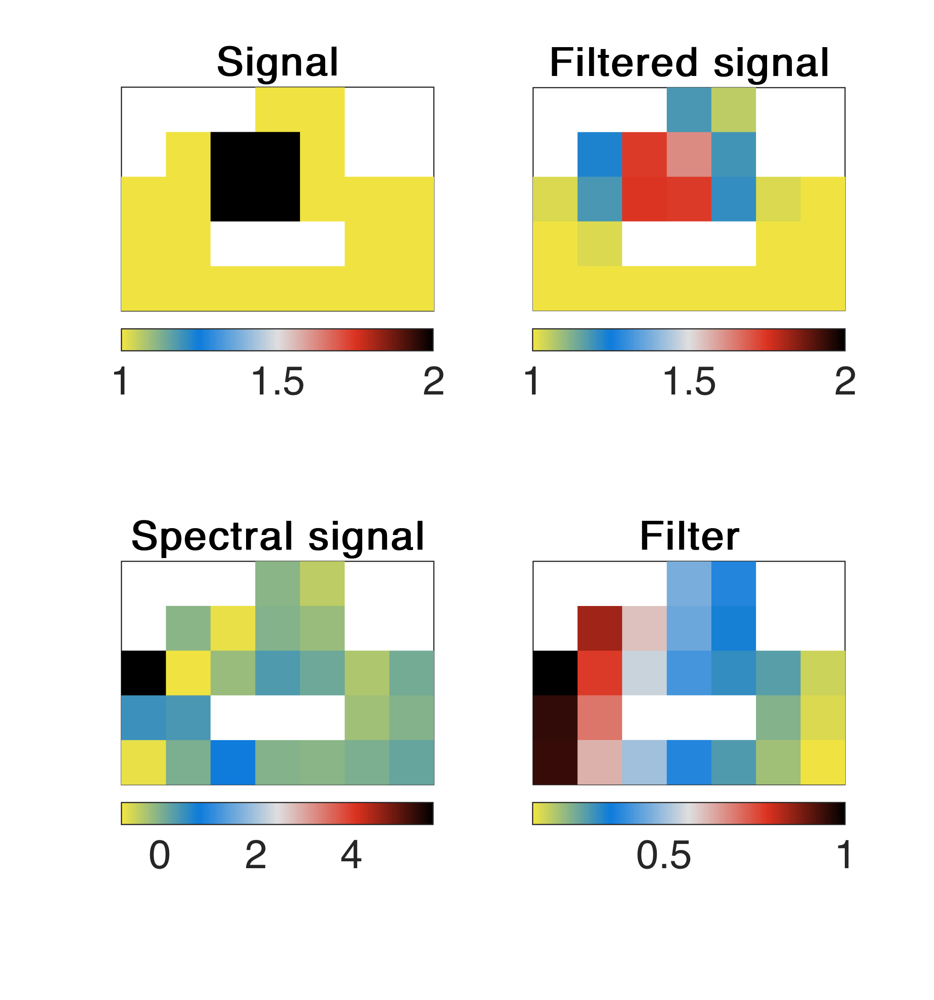
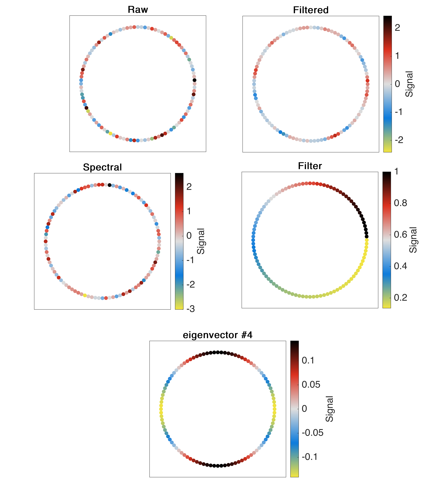

# :signal_strength::grapes: Signal on a graph
diego domenzain
December 2021 @ Tepoztlan

## Filter a signal on a graph

Let :grapes: be a graph, and let :signal_strength: be a mapping of :grapes:→ ℝ. 

We can filter this signal just as one would filter a ℝ signal in time with Fourier :astonished:.

The trick is to,

   * use the eigenvectors of the graph Laplacian as the change of basis one would do with 𝓕,
   * filter the eigenvalues as one would filter the 𝓕 coefficients.

That's it. It's brilliant.

## Examples

1. Figure 1
   * **1a** shows the graph :grapes: of a grid (but with some holes) with a square embedded in it.
   
   * **1b** shows how the :signal_strength: signal (the square) is filtered (smoothed).
   
   * **1c** shows how the signal looks in the spectral domain (like in 𝓕).
   
   * **1d** shows the filtered that was used.
   
1. Figure 2
   * **2a** shows the Laplacian of the graph :grapes:.
   
   * **2b** shows the second eigenvector embedded in the graph :grapes:. So cool.
   
1. Figure 3 - the same as Figures 1 & 2 but with a cyclic graph.

