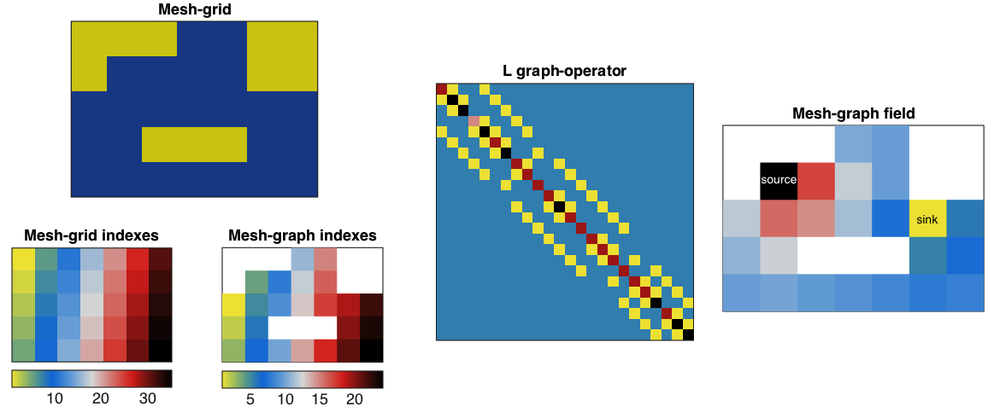

# Mesh on a grid
diego domenzain
April 2021 @ Colorado School of Mines

## Mesh with neighbor information

Given a region of space discretized in a matrix,

* find only the nodes that matter in the domain, 
* find their neighbors,
* find what type of neighbors they have.

__This script is an example of a mesh generation on a grid.__

---

