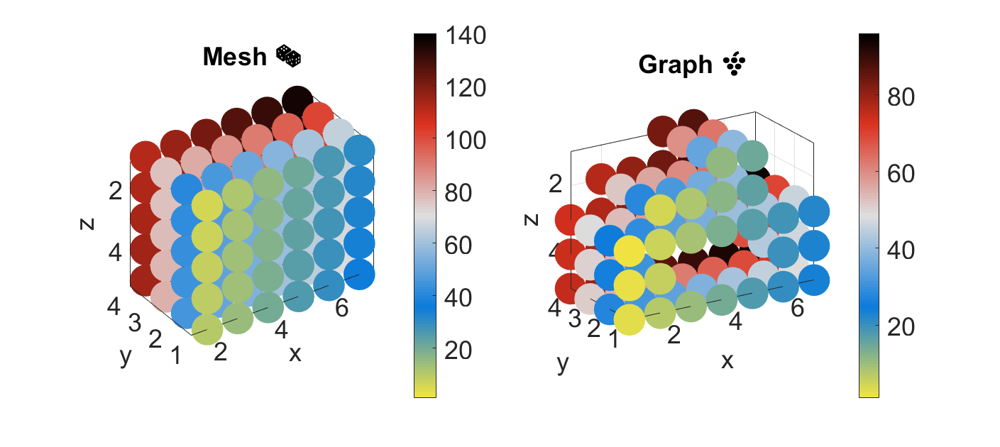

# Mesh on a 3d grid :game_die: :grapes:
diego domenzain

August 2021 

```
          .--------------------.
         / |   🐜      🌳🐛  /|
        /  |                 / |
       /🌴        🏃        /  |
      .--------------------.   |
      |    |          🐙   |   |
      |    . --------------|---.
   z  |   /                |  /
      |  /   🐟            | / y
      | /               👽 |/
      .--------------------.
                  x
                  
xyz
(iy,ix,iz)
```

## Mesh with neighbor information :two_women_holding_hands:

__Given a rectangular gridded mesh where only a certain region is wanted for modeling, how do we extract this wanted region?__

This code answers this question by finding three key constructs:

1. find only the nodes that matter in the domain, 
1. find their neighbors,
1. find what type of neighbors they are.

The words **mesh** or **mesh-grid** :game_die: refer to the existing rectangular gridded mesh.

The word **graph** :grapes: refers to the region of interest inside the mesh-grid.

The *Matlab* code uses lots of ```for, while``` and ```if``` **on purpose**. It is meant to be **pseudocode** for *Fortran*.

```
1. The only nodes that matter in the domain are given in these two column vectors,

graph2mesh : indexes are graph nodes, entries are mesh nodes
mesh2graph : indexes are mesh nodes, entries are graph nodes

graph2mesh:

| |
| |
| | size = # of nodes that matter by 1
| |
| |
| |

mesh2graph:

| |
| |
| | size = # of nodes in the mesh by 1
| |
| |
| |
| |
| |

2. Their neighbors are given by these two matrices,

neigh_mesh  : row indexes are graph nodes. Row entries are neighbors of that node, in the mesh.
neigh_graph : row indexes are graph nodes. Row entries are neighbors of that node, in the graph.

3. Their neighbor type is given by this matrix,

neigh_type : row indexes are graph nodes. Row entries are the type of neighbor for that node.

neigh_mesh, neigh_graph, and neigh_type are all of size:

|        |
|        |
|        | size = # of nodes that matter by max # of neighbors in the mesh
|        |
|        |
|        |

since we are assuming a 3D mesh-grid, max # of neighbors in the mesh is 4.

the way the neigh_mesh, neigh_graph, and neigh_type refer to the neighbors of node 'i' (i.e. in row 'i') is by,

      2  6
      | /
 3 -- i -- 1
    / |
   5  4

that is, columns 1, 2, 3, 4, 5 and 6,
represent neighbors right, up, left, down, front and back.
```

We can now begin to build the PDE operator ```L```.

```
we need L to be defined as a sparse matrix,
so we need arrays I and J to do:

       L = sparse(I,J,v);

where 'v' is special.

1. we need the total number of non-zero entries on L.
that is for each row i of L, we have as many entries as neighbors of i +1.
the +1 term counts its own entry.

2. we also need to count for each node in the graph, 
how many entries in 'I' (and 'J') are of that node.

for 1, we sum all positive entries of neigh_type +n_g2m.
the term +n_g2m accounts for all L(i,i) entries.

for 2, we sum column-wise all positive entries of neigh_type.

n_IJ : total number of non-zero entries of L (also length of 'I' and 'J').
n_ij : holds the info of how many entries in 'I' (and J) belong to each node i.
       it is an array of size n_g2m by 1.

now we need to build 'I' and 'J'.

both 'I' and 'J' are of size n_IJ by 1.

'I' denotes the row entries, and 'J' the column entries.

for each node i:
   'I' needs to have n_ij(i)+1 consecutive entries with the number 'i'.
   In the same place as these n_ij(i)+1 consecutive entries, 
      'J' needs to have the number 'i' in the first entry, 
      and then each neighbor of 'i' (in the graph) in the subsequent entries.
```
The last step is to build the entries ```V``` of ```L``` using ```J``` and ```neigh_type``` (for Robin boundary conditions).

In general, ```L``` could be any differential operator you could think of. In particular, I assume ```L``` is the left-hand side of this PDE,

-∇⋅σ ∇ ϕ = s

where σ is conductivity, ϕ is the sought-after field, and 's' is the source term.

### Fortran to-do list

```matlab
% build mask 😷 as a 3d matrix 🎲 in the mesh in just one column
[ny,nx,nz]=size(a_);
a(iyxz,:) = a_(iy,ix,iz);

% build structs for handling 🎲 and 🍇
n_g2m = n_g2m_3d_(a,nx,ny,nz);
[graph2mesh,mesh2graph] = g2m_m2g_3d(a,nx,ny,nz,n_g2m);
neigh_mesh = neigh_mesh_3d_(a,nx,ny,nz,n_g2m,graph2mesh);
neigh_graph= neigh_graph_3d_(neigh_mesh,mesh2graph,n_g2m);
neigh_type = neigh_type_3d_(a,nx,ny,nz,n_g2m,graph2mesh);
[n_ij,n_IJ]= nIJ_3d(n_g2m,neigh_type);
[I,J] = IJ_3d_(n_g2m,n_ij,n_IJ,neigh_graph);

% build source
% srcs_xyz  : (nsources) × (xyz) × (±) . indexes in the mesh cube 🎲

% build 🐦 & α's
[robin_graph,robin_xyz,n_ar] = robins_3d(n_g2m,nx,ny,nz,graph2mesh,mesh2graph,neigh_type);
alphas = get_alphas(x,y,z,srcs_xyz,robin_xyz);

% build matrix L 🔷🔺
V = dcipL3d(n_g2m,n_ij,n_IJ,I,J,neigh_mesh,graph2mesh,robin_graph,alphas,n_ar,sig,x,y,z);
L = sparse(I,J,V);

% solve for u using 🌴

% build matrix S 🔺🔷
V = dcipS3d(n_g2m,n_ij,n_IJ,I,J,neigh_mesh,graph2mesh,robin_graph,alphas,n_ar,sig,phi,x,y,z);
S = sparse(I,J,V);
```

---

### Tiny example (*Matlab*)

[](./)

