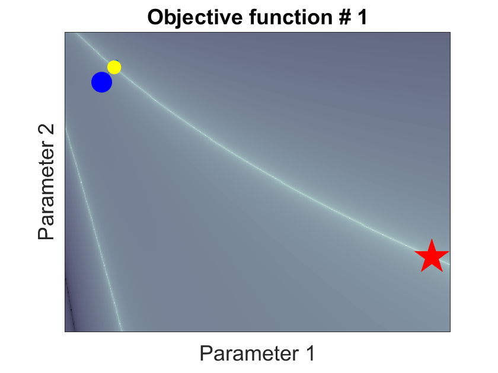
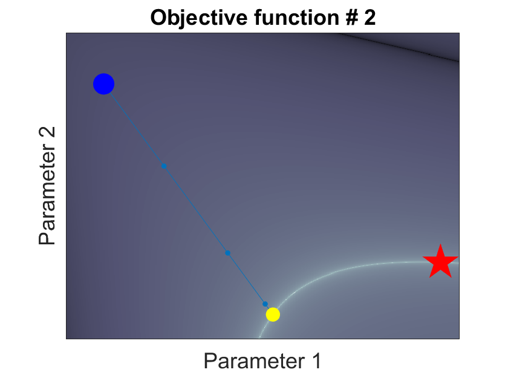

# mini Joint inversion
diego domenzain
September 2020 @ Colorado School of Mines

## What is joint inversion?

Two (or more) processes that are sensitive to the same parameters in different ways, are joined in one single objective function.

This way, both processes complement each other during the inversion.

__These scripts are an example of joint inversion.__

## The processes

Here, they are called _dc_ and _w_. They do not represent any physical system. However, they do emulate the mathematical description of a physical system.

Both _dc_ and _w_ are governed by a matrix equation, a source term, and a measuring operator:

_Lu = s_

_d = Mu_

where _L_ is a differential operator as a function of the physical parameters _p_, _u_ is the physical quantity (e.g. heat, electric potential, etc), _s_ is the source term, _M_ is the measuring operator, and _d_ is the data.

## The inversion

This is done with gradient descent, where the gradients are computed using the adjoint method. 

## The scripts

* ```optimize_[dc,w].m``` perform inversions on just one process.
* ```optimize_joint.m``` performs the joint inversion of both processes together.

---

This is just from the ```dc``` inversion,

[](./)

This is just from the ```w``` inversion,

[](./)

This is from the ```joint``` inversion. Note how the optimization path towards the solution is greatly improved when compared to the other two.

[](./)