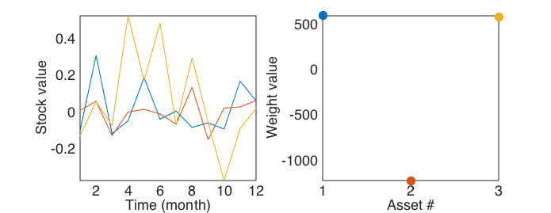

# Markowitz Portfolio Optimization
diego domenzain
September 2020 @ Colorado School of Mines

You want to invest money, and you want to make sure you do not lose it. So, you make the trick of betting for and against.

__How do you find how much betting for and against?__

You minimize ```f(w)``` using _Lagrange multipliers_,

```matlab

f(w) = w.' S w - l1*(r.'w - rho) - l2*(e.'w - mu)

```

where ```w``` is a vector of weights, ```S``` is the covariance matrix of the time-series stock values, ```r``` is a vector of the expected returns of the stock values, ```rho``` is the target expected return, ```e``` is a vector of just ones, and ```mu``` is the available quantity for investment.

```w.' S w``` is the variance of the portfolio return.

This transforms to a matrix problem of the form,

```matlab

[ 2*S -r -e ]   [w ]   [0  ]
[ r.'  0  0 ] * [l1] = [rho]
[ e.'  0  0 ]   [l2]   [mu ]

```

where the task is to find ```w, l1``` and ```l2```. However, we are really only interested in ```w```.

---

This is assuming ```rho = 50``` and ```mu = 1```. Note the short position on asset No. 2.

[](./)
