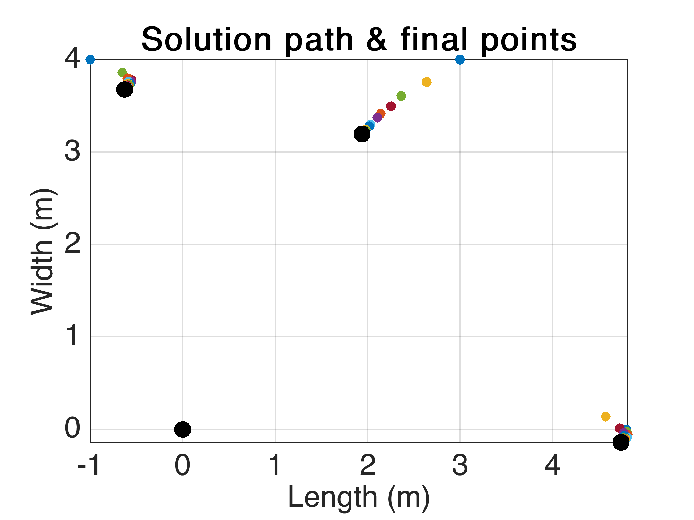

# Relative coordinates
diego domenzain
Nov. 2021

* ```rela_coords.m & rela_coords__.m``` Given measurements of relative distances between 4 points, return cartesian coordinates of these points.
* ```rela_coords_.m``` generalizes this to an arbitrary number of points & to arbitrary relative distances between them.

## 🌳🛰⛔

Lets say you went to the field and did measurements on a bunch of points, but the GPS was 💩 and you couldn't get coordinates. Do this:

1. get relative distances between all points

	* doing this on a triangulation of the points is best

1. input the graph information,

	```
	neigh → is a matrix of size (# of points × max # of neighbors) ℕ
	distao→ is an array of size # of edges ℝ>0.
			these are the relative distances between all points.
	xy    → is an array of size (2 · # of points) ℝ. 
			these are the coordinates of the points that will be found.
			the first half of this array is the x coordinate
			the second half of this array is the y coordinate.
	```
1. run my code. it's great.

---


