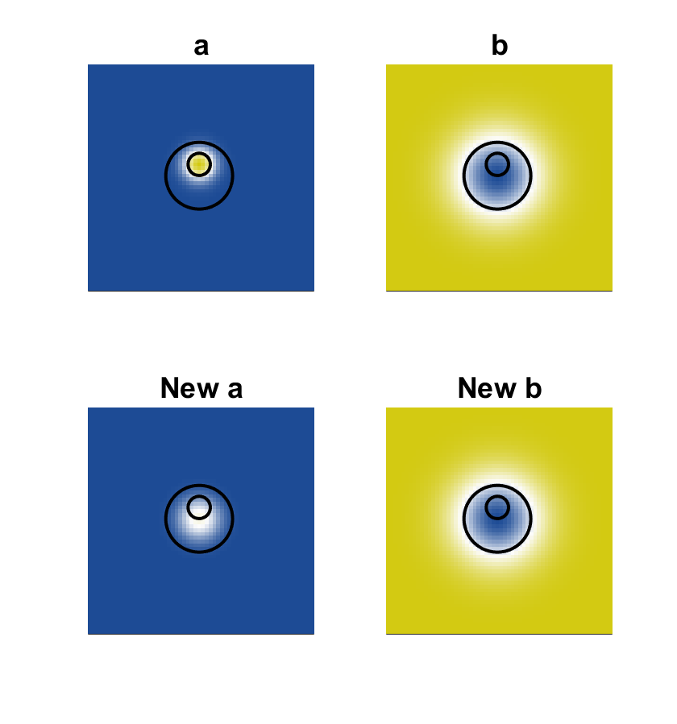

# Cross-gradients
diego domenzain
September 2020 @ Colorado School of Mines

## What is the cross-gradient constraint?

Two (or more) physical parameters can share structure. Here, the parameters are two-dimensional matrices.

The question is then, how can we transfer the structure of one parameter onto the other?

__This script is an example of cross-gradient inversion.__

## The parameters

Here, they are called __a__ and __b__. They do not represent any physical parameters. However, they do emulate the mathematical description of a physical parameter.

## The inversions

There are three possibilities,

* __a__ and __b__ get to be like each other,
* __a__ gets to be like __b__ (and __b__ is fixed),
* __b__ gets to be like __a__ (and __a__ is fixed).

These inversions are done with gradient descent.

## The scripts

* ```xgrad_ex_circs.m``` perform these inversions on two discs for __a__ and __b__.
* ```xgrad_ex_circ_box.m``` performs these inversions on a disc and a square for __a__ and __b__.

---

This is the result of making both __a__ and __b__ look like each other. Note how both shapes are deformed:

the __New a__ and the __New b__ agree in shape on a weird shape.

[](./)

This is the result of making __a__ look like __b__. Note how __a__ changes and __b__ remains constant:

the __New a__ now looks more like __b__ and the shape is not deformed.

[](./)

This is the result of making __b__ look like __a__. Note how __b__ changes and __a__ remains constant:

the __New b__ now looks more like __a__ and the shape is not deformed.

[](./)
