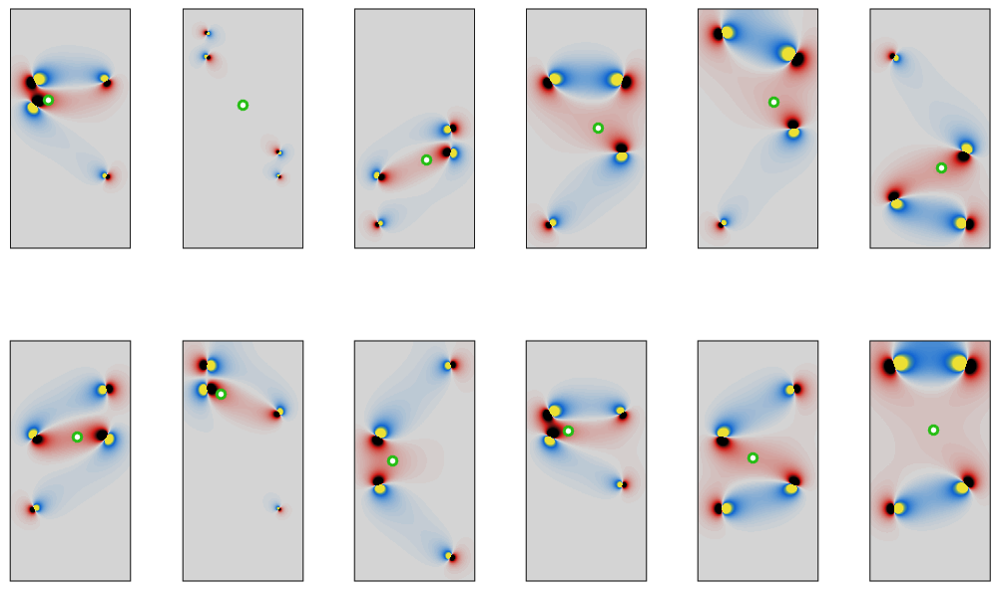

# DC x-borehole data visualization
diego domenzain

June 2021 @ Aarhus University 

## 👓 Sensitivity
For an **abmn** quadrupole, the sensitivity is:

👓 = ∇φ ⋅ ∇ v 

where,

-∇ ⋅ ∇ φ = source a - sink b

-∇ ⋅ ∇ v = source m - sink n

See Line's [.pdf](https://github.com/LineMeldgaardMadsen/ERT-XBH-sensitivity/blob/main/Catalogue_2D%20ERT_sensitivity.pdf) for more info.

## 👀 Visualize cross-borehole data 

### Localizing the sensitivities 👓 ⤍ ⚫

The location is the [geometric median](https://en.wikipedia.org/wiki/Geometric_median) of the **abmn** quadrupole positions in 3d space.

[](./)

### Data structures 📚

```electrodes```
is a matrix of size ```nelectrodes```× 3. With entries of *xyz* coordinates, and indexes pointing to all electrodes.

```abmn```
is a matrix of size ```nabmn```× 4. With entries of indexes of ```electrodes```, and indexes pointing to all ABMN quadrupoles.

```pseud```
is a matrix of size ```nabmn```× 3. With entries of *xyz* coordinates, and indexes pointing to ```abmn```.

```data```
is a matrix of size ```nabmn```× 1. With entries of data (V, Ωm, ...), and indexes pointing to ```abmn```.

```klusters_```
is a cell of size ```nklu```. With entries of indexes of ```abmn``` (and so of ```pseud``` as well), and indexes pointing to clusters in ```pseud```.

### Data cleanup 📚⤍📘📗📕

Someone is like *dude, electrode #3 was shit. You have to remove it from the dataset*.

And then you're like *no problem,  it's cool*.

Let ```ielectrode_[a,b,m,n]``` be the electrodes indexes where ```ielectrode``` appears in ```abmn``` as a, b, m, or n.

```
ielectrode_a = abmn(find(abmn(:,1)==ielectrode_a),:);
ielectrode_b = abmn(find(abmn(:,2)==ielectrode_b),:);
ielectrode_m = abmn(find(abmn(:,3)==ielectrode_m),:);
ielectrode_n = abmn(find(abmn(:,4)==ielectrode_n),:);
```
Now you do this,

* delete ```ielectrode``` from ```electrodes```, 
* delete the collection ```ielectrode_[a,b,m,n]``` from: 
  * ```abmn```
  * ```pseud```
  * ```data```
* recompute ```klusters_```.

### AB.MN quadrupoles 🍀

[](./)

[](./)

### Code 📝

* ```pseudo_vis.m``` simple example script. Assumes all electrodes in Tx borehole can be **ab** pairs.
* ```pseudo_vis_.m``` fancier example script. It can handle case when only *some* electrodes of Tx borehole can be **ab** pairs.
* ```kaergaard_vis.m``` simple example to visualize with field data.

