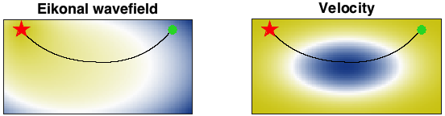

# Eikonal equation in 2d
diego domenzain
September 2020 @ Colorado School of Mines

## The eikonal equation discretized

When simplifying wave propagation to only first-arraival times, we get the Eikonal equation.

__This script is an example of the solution for the 2d eikonal equation with variable velocity.__

---

