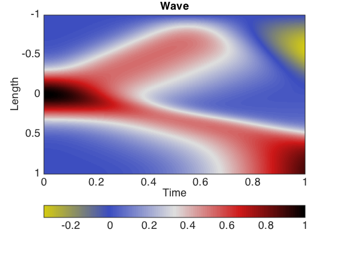

# 2D elastic SV wave equation
diego domenzain
September 2020 @ Colorado School of Mines

## Discretization of the 2D elastic SV wave equation

2D elastic SV wave propagation (without intrinsic attenuation) is a function of the _Lamé parameters_ and the _density_. Both parameters control the wave speed.

__This script is an example of the solution for the 2d wave equation with variable coefficients.__

```matlab
two-dimensional elastic SV wave

rho*dt(v)= grad * T + F
s*dt(u)  = grad.' * v - tau*T

where,

v = [vx ; vz]       particle velocity
T = [sxx; sxz; szz] stress

grad = [dx 0  dz]
       [0  dz dx]

inv(s) = [lam+2*mu lam        0]
         [0         0        mu]
         [lam       lam+2*mu  0]
```
---

Note how in both examples the wave is not propagated in a homogeneous way. 

This is because we use variable coefficients in space.

[](./)

[](./)

