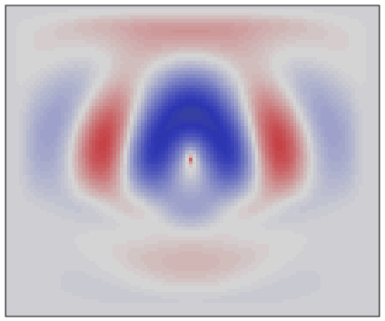

# 2D elastic SV wave equation
diego domenzain
September 2020 @ Colorado School of Mines

## Discretization of the 2D elastic SV wave equation

This pic is probably an artifact but it looks cool.
[](./)

2D elastic SV wave propagation (without intrinsic attenuation) is a function of the _Lamé parameters_ and the _density_. Both parameters control the wave speed.

__These scripts are an example of solving the 2d wave equation with variable coefficients.__

The equations to be solved are as follows,

```matlab
two-dimensional elastic SV wave

rho*dt(v)= grad * T + F
s*dt(u)  = grad.' * v - tau*T

where,

v = [vx ; vz]       particle velocity
T = [sxx; sxz; szz] stress

grad = [dx 0  dz]
       [0  dz dx]

inv(s) = [lam+2*mu lam        0]
         [0         0        mu]
         [lam       lam+2*mu  0]

tau = viscosity matrix. do not know how it looks like :( 

vp = sqrt((lam + 2*mu)./rho)
vs = sqrt(mu./rho)

mu  = rho.*vs^2
lam = (vp.^2 - 2*vs.^2).*rho = rho.*(vp.^2 - 2*vs.^2)
```

## References

1. [__P-SV wave propagation in heterogeneous media: Velocity-stress finite-difference method__](https://library.seg.org/doi/abs/10.1190/1.1442147). Jean Virieux, *Geophysics* 1986.
1. [__A variational formulation of a stabilized unsplit convolutional perfectly matched layer for the isotropic or anisotropic seismic wave equation__](https://citeseerx.ist.psu.edu/viewdoc/download?doi=10.1.1.725.5041&rep=rep1&type=pdf). Roland Martin, Dimitri Komatitsch, and Stephen D. Gedney, *Computer Modeling in Engineering and Sciences*, 2008.
1. [__Time Domain 2D Elastic Full Waveform Tomography__](https://macau.uni-kiel.de/receive/diss_mods_00006786). Daniel Koehn. *PhD thesis*, 2011.

## Inspiration

* [Nienke Blom](https://github.com/Phlos/fd2d-adjoint), __Matlab__ sponge BC. Utrecht Uni + ETH, NL+CH. *Earthquake Seismic FWI*.
* [Jan Thorbecke](https://github.com/JanThorbecke/OpenSource/tree/master/fdelmodc), __C__ sponge BC. TU-Delft, NL. *Interferometry and Marchenko*.
* [Dimitri Komatitsch](https://github.com/geodynamics/seismic_cpml/blob/master/seismic_CPML_2D_isotropic_second_order.f90), __Fortran__ CPML BC. Inria, FR. *Visco-poro-acoustic-elastic 3D, 2D, isotropic and anisotropic suite of codes*.
* [Daniel Koehn](https://github.com/daniel-koehn/DENISE-Black-Edition), __C__. Christian-Albrechts-University Kiel. *Elastic FWI for all the Germans*.

All these codes are good, but __Dimitri's__ code is extremely cool. It's *out-of-control* cool. Also comes with a cool [document](http://hal.inria.fr/docs/00/07/32/19/PDF/RR-3471.pdf).

The _Fortran_ CPML implementation of Dimitri is modified to account for heterogeneous media and implemented here in _Matlab_ in the script,

```
elasticSV2d_order2_pml.m
```

This Fortran code (as far as I know) is the basis of the famous [__specfem2d__](https://github.com/geodynamics/specfem2d).

## Free surface

The script ```elasticSV2d_pml_freesurf.m``` has free surface boundary conditions at the top.

Inspired by [Daniel Koehn's](https://macau.uni-kiel.de/receive/diss_mods_00006786) PhD thesis.

---

This picture shows off the power of the CPML absorbing boundary conditions.

[](./)

This picture shows off the power of the free surface conditions.

[](./)
