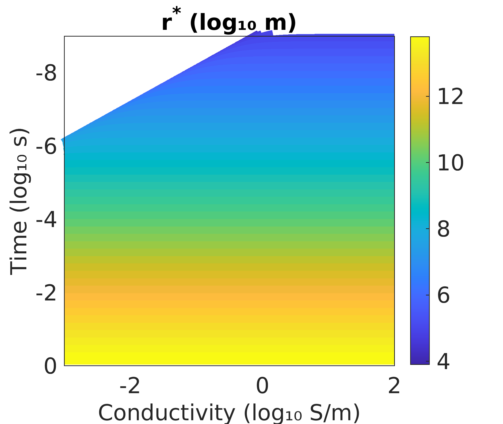
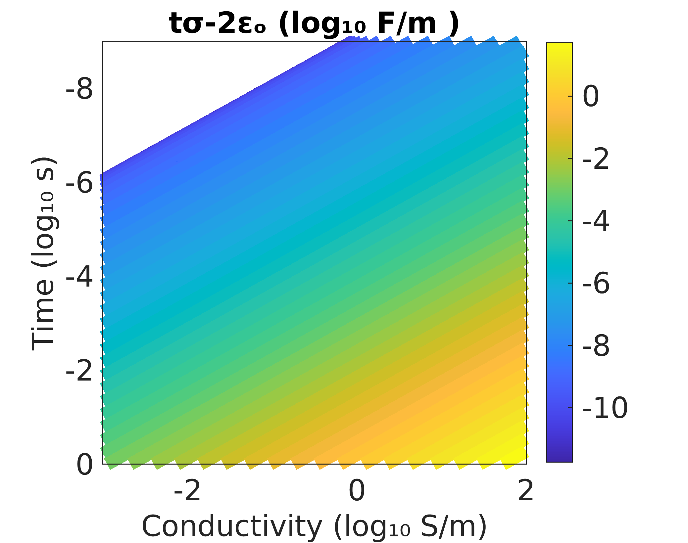
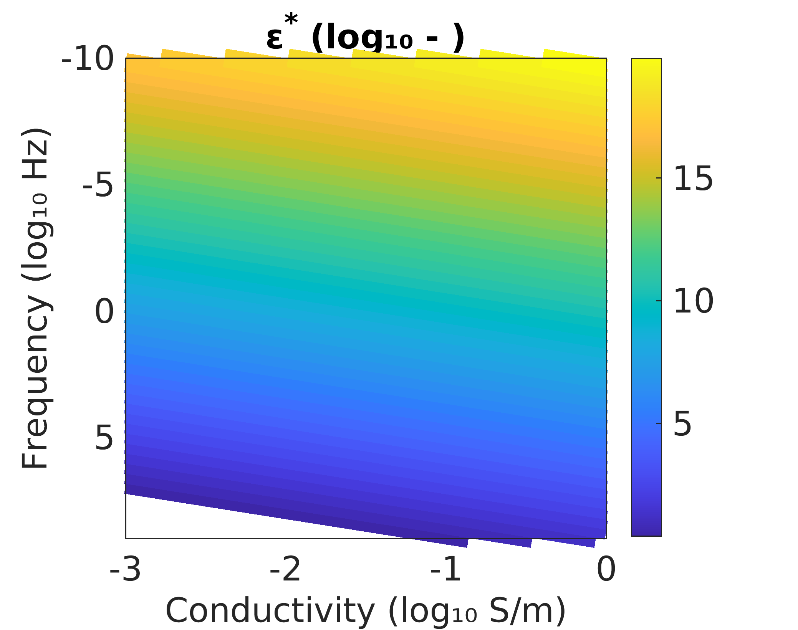

# 🔥🌊 

## is EM wave propagation asymptotically equal to diffusion?

if this happens then yes,

                           √(t² - R²/v²) >> 2ε/σ
                       ⟹             R² << v² ⋅ (t² - 4ε²/σ²)

t is time that has passed and, R is distance from source to receiver.

📖 "Diffusion of electromagnetic fields into a two-dimensional earth: a finite difference approach" Oristaglio and Hohmann, 1984.

💡🟢 this 👇 approach is easier to check as criteria,

                            R² << v² ⋅ (t² - 4ε²/σ²)
                        let r* = √(v² ⋅ (t² - 4ε²/σ²))

* if r*  >> 0  ⟹ diffusion
* if r*   > 0  ⟹ wavey diffusion
* if r*²  < 0  ⟹ wave 💯

🚨🚨 large & small compared to closest offset rx.

[](./)

💡🟢 another 👇 easier way to see it 👌 (valid in free-space),

                 let Ï = v² â‹… (t² - 4ε²/σ²)

Ï can be large, small, or negative. Since 2ɛₒ is about 10â»Â¹Â¹,

* tσ - 10â»Â¹Â¹ >> 0  ⟹ diffusion
* tσ - 10â»Â¹Â¹  > 0  ⟹ wavey diffusion
* tσ - 10â»Â¹Â¹  < 0  ⟹ wave 💯

[](./)

## is the media a poor conductor or a good conductor?

```
σ << ωε poor conductor
σ >> ωε good conductor
```
or,

```
ε >> σ/ω poor conductor
ε << σ/ω good conductor
```

💡🟢 let ε* = σ/ω/ɛₒ.

* if ɛᵣ >> ε* ⟹ poor conducctor
* if ɛᵣ << ε* ⟹ good conducctor

[](./)
