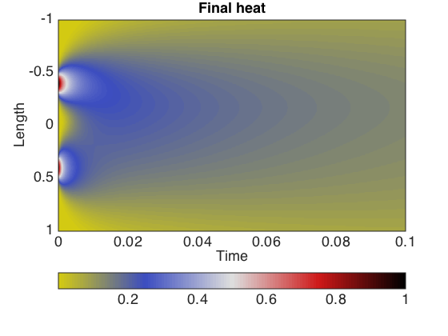

# Heat equation in 1d and 2d
diego domenzain
September 2020 @ Colorado School of Mines

## The heat equation discretized

Heat is a function of _thermal conductivity_ and the _kappa_ coefficient (the inverse of specific heat times density).

__These scripts are an example of the solution for the 1d and 2d heat equation with variable coefficients.__

---

Note how in both examples the heat is not transferred in a homogeneous way. 

This is because we use variable coefficients in space.

