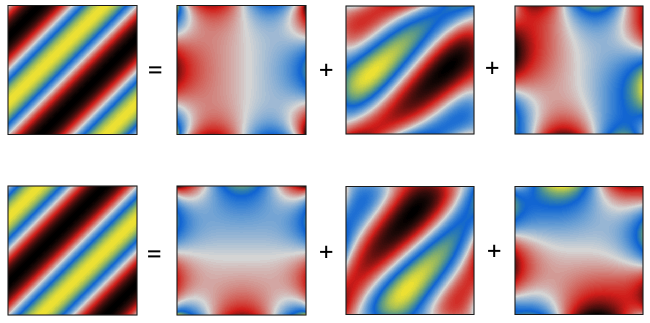
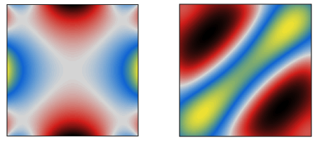

# Helmholtz-Hodge Decomposition
diego domenzain

April 2021 @ Colorado School of Mines

## Discrete implementation of the Helmholtz-Hodge Decomposition

[](./)

__These scripts are an example of solving the Helmholtz-Hodge Decomposition on a two-dimensional vector field.__

## Basics

Let **u** be a 2D vector field,

**u** = grad φ + rot ψ + **h**

**u** = ∇φ + ∇ × ψ + **h**

where,

∇φ = (∂x φ, ∂y φ),

∇ × ψ = (∂y ψ, -∂x ψ),

∇ × **h** = ∇⋅**h** = 0.

We solve for ψ and φ given by,

∇⋅∇ φ = ∇ ⋅ **u**

∇⋅∇ ψ = -∇⋅**J** **u**

**h** = **u** - ∇φ - ∇ × ψ

where **J** is rotation by π/2,

```
J = [0 -1]
    [1  0]
```

## Approach 1

There are a couple of different approaches for finding φ and ψ. Here, I follow *Harsh Bhatia et al*.

The idea is to incorporate open-flow boundary conditions in a *natural way*, whatever that means.

This accomplished by "solving" for φ and ψ by putting ∇⋅∇ on the other side of the equality as ∫ _g_ ⋅ dΩ,

φ(**xo**) = ∫ _g_ ∇ ⋅ **u** dΩ

ψ(**xo**) = - ∫ _g_ ∇⋅**J** **u** dΩ

where g is the Green function that solves the Laplace equation on Ω with a source at **xo**.

**Note:** I am not entirely sure the boundaries are well recovered. I should check that.

All these implement this idea:
```
hhd_simple.m (60 seconds)
hhd_cool.m   (60 seconds)
hhd_cooler.m the integral operator is coded in Fortran-Mex (no speed-up 😢)
hhd_faster.m the integral operator is stored in memory (0.01 seconds but lots of memory)
``` 

## Approach 2

Discretize the operator ∇⋅∇ and solve for:

∇⋅∇ φ = ∇ ⋅ **u**

∇⋅∇ ψ = -∇⋅**J** **u**

This one implements this idea,
```
hhd_fast.m (0.5 seconds, light on memory)
```
The Laplacian operator is built using the *alles/projects/graph-alg/mesher/* project.

## References
1. **The Natural Helmholtz-Hodge Decomposition for Open-Boundary Flow Analysis**. *Harsh Bhatia, Valerio Pascucci, Peer-Timo Bremer*. IEEE Transactions on Visualization and Computer Graphics, 2014.
1. **The Helmholtz-Hodge Decomposition — A Survey**. *Harsh Bhatia, Gregory Norgard, Valerio Pascucci, Peer-Timo Bremer*. IEEE Transactions on Visualization and Computer Graphics, 2013.

---

Below are φ and ψ.

[](./)