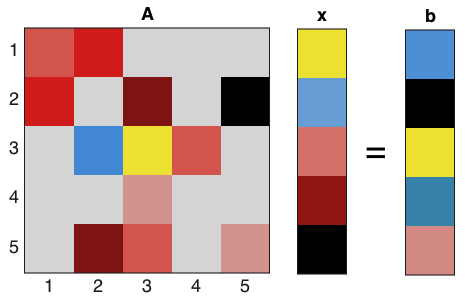

# Umfpack demo
diego domenzain
April 2021 @ Colorado School of Mines

## Solve a sparse system of equations

[](./)

__These scripts are an example of solving a sparse system of equations using UMFPACK.__

This whole project is from [this great](https://userpages.umbc.edu/~rostamia/cbook/) book.

## Sparse matrix

For the *triplet form* we need three vectors: ```I, J``` and ```V```. 

In *Matlab* this would be ```A = sparse(I,J,V)```.

For the *Compressed Column Storage* (**CSS**) form - which is actually more clever - we need vectors ```I, P``` and ```V```.

```matlab
% A of size m by n
m = 4;
n = 5;
A = [0 7 0 0 1; 0 4 0 3 0; 6 6 5 1 4; 5 5 0 0 0];

% gives the triplet form I, J and V,

I = [2 3 0 1 2 3 2 1 2 0 2];
J = [0 0 1 1 1 1 2 3 3 4 4];
V = [6 5 7 4 6 5 5 3 1 1 4];

A = sparse(I+1,J+1,V);

% CSS notation asks for P.
% P is a clever substitute for J.
%
% build of P is like so,
% 
% 0. P is of size columns of A plus 1,
% 1. count repeated entries in J,
% 2. sum these repetitions recursively and put partial results in P.

% init P
P = zeros(1,n+1);
% count repeated entries in J
2 4 1 2 2
% sum them recursively and store (starts at 0)
0, 2, 2+4=6, 6+1=7, 7+2=9, 9+2=11

P = [0 2 6 7 9 11];

% gives the CSS form by I, P and V:

P = [0 2 6 7 9 11];
I = [2 3 0 1 2 3 2 1 2 0 2];
V = [6 5 7 4 6 5 5 3 1 1 4];
```

## Umfpack install

This is your problem. This code assumes it has already been done.

The [Umfpack website](https://people.engr.tamu.edu/davis/suitesparse.html) might be a good place to start.

In my personal computer the address to the *Umfpack* libs relative to this directory is:

```../../../../SuiteSparse/UMFPACK/Include/umfpack.h```

## ```umfpack-simple.c```

Simple, straight-forward, trackable example.

```bash
$> make
$> make clean
$> ./umpfpack-simple
```

## ```umfpack-cool.c```

Builds on ```umfpack-simple.c```. Mostly just adds error & warning handles.

```bash
$> make
$> make clean
$> ./umpfpack-cool
```

## ```umfpack_cool.f90```

Implements *Umfpack* in *Fortran*. Builds on ```umfpack-cool.c```.

The error & warning handles of ```umfpack-cool.c``` are not implemented here. It is very difficult to find clear documentation of porting *Umfpack* to *Fortran* online.

The "porting" is done via the *C* wrapper ```SuiteSparse/UMFPACK/Demo/umf4_f77wrapper.c```.

Not all features of *Umfpack.c* are in *Umfpack.f*. For example, the matrix has to already be in CSS format. 

Even more annoyingly, the names of the functions change when using *Umfpack.f*. For a dictionary of this nonsense, see the *Umfpack User Guide, Chapter 7* (in ```SuiteSparse/UMFPACK/Doc```).

```bash
$> gfortran -c umfpack_cool.f90
$> gcc -c ../../../../SuiteSparse/UMFPACK/Demo/umf4_f77wrapper.c
$> gfortran umfpack_cool.o umf4_f77wrapper.o -L../../../../SuiteSparse/lib -lumfpack 
$> ./a.out
```

## References
[Programming Projects in C for Students of Engineering, Science, and Mathematics](https://userpages.umbc.edu/~rostamia/cbook/). *Rouben Rostamian*. SIAM, 2014.

---