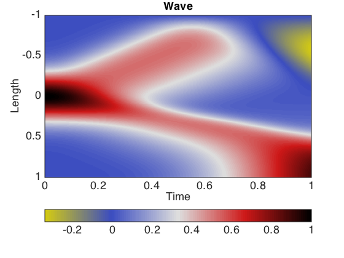

# Wave equation in 1d and 2d
diego domenzain
September 2020 @ Colorado School of Mines

## The wave equation discretized

Electromagnetic wave propagation (without intrinsic attenuation) is a function of _magnetic permeability_ and the _permittivity_. Both parameters control the wave speed.

__These scripts are an example of the solution for the 1d and 2d wave equation with variable coefficients.__

---

Note how in both examples the wave is not propagated in a homogeneous way. 

This is because we use variable coefficients in space.

