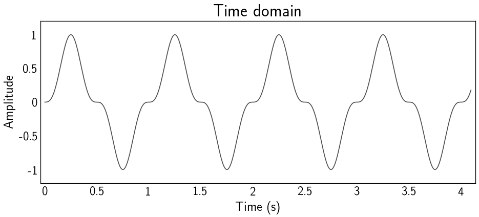
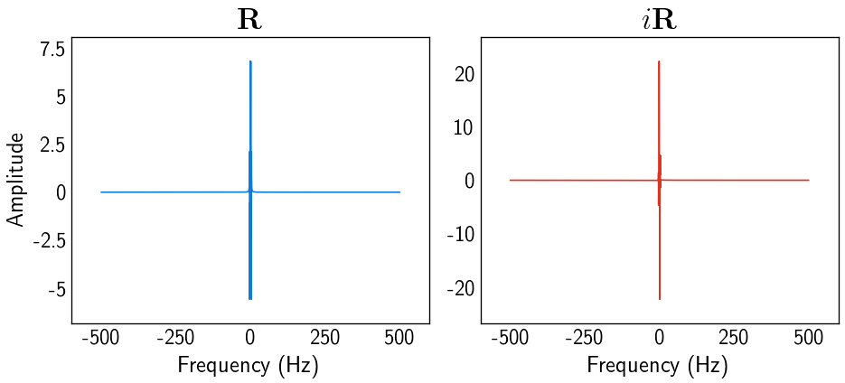

# Fast Fourier transform
diego domenzain

March 2021 @ Colorado School of Mines

## Discrete Fast Fourier Transform in Fortran.

1d ```DFFT``` computation in *Fortran*, and visualization in *Python*.

__These scripts are examples of the DFFT.__

The ```DFFT``` is taken from [Thomas Forbriger](https://git.scc.kit.edu/Seitosh/Seitosh).

## Fourier Transform

In the terminal:

```bash
gfortran -c ../../../src/fortran/fourier.f90 fourier_ex.f90
gfortran fourier.o fourier_ex.o
./a.out
```
This prints the data, the Fourier coefficients, the time axis, and the frequency axis (without ```fftshift```) to ```.dat``` files.

You can then visualize them with *Python*,

```bash
python visualize_f.py
```

---

[](./)

[](./)
