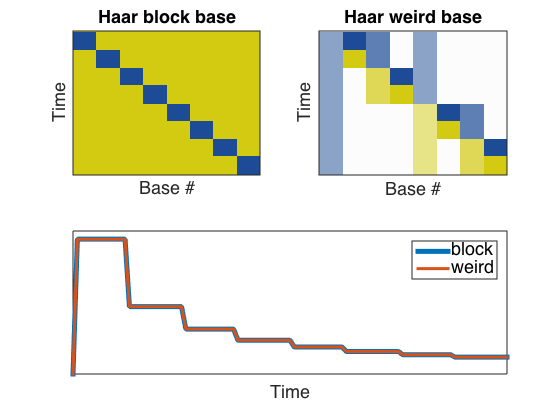
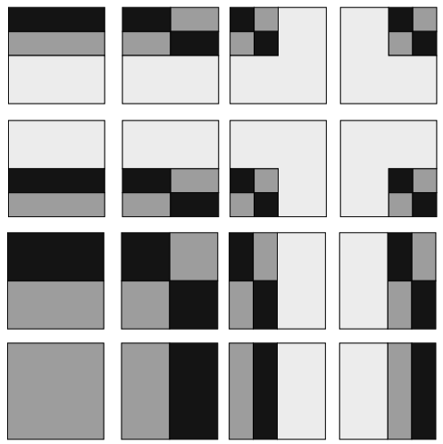

# Haar wavelet compression
diego domenzain
September 2020 @ Colorado School of Mines

## Given a pic, compress it using Haar wavelets.

2d Haar wavelets are rectangle thingies that tile the plane.

__These scripts are examples of the Haar wavelet decomposition.__

This whole project is from [this great](https://userpages.umbc.edu/~rostamia/cbook/) book.

## Haar transform (no pics, just see basis elements)

In the terminal:

```bash
make
make clean
./haar-test
```
This prints the coefficients in the *blocky* Haar basis, and the found  coefficients in the *weird* Haar basis.

To convince you the Haar transform code is good, visualize it with Matlab running the script,

```matlab
haar_see.m
```
This script has hard-coded the values printed by the executable ```haar-test```.

It displays,
1. the elements of the *blocky* Haar basis,
2. the *weird* Haar basis,
3. the function in the *blocky* basis,
4. and the same function in the *weird* basis.

[](./)

## Haar transform on pictures

Under construction.

## References
[Programming Projects in C for Students of Engineering, Science, and Mathematics](https://userpages.umbc.edu/~rostamia/cbook/). Rouben Rostamian. SIAM, 2014.

---

These handsome squares are the Haar 2D basis for a discretized domain containing 16 pixels.

Picture modified from the [book](https://userpages.umbc.edu/~rostamia/cbook/).

[](./)