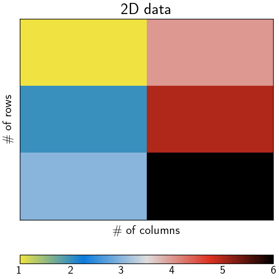

# Run *Fortran* in *Matlab*
diego domenzain
March 2021 @ Colorado School of Mines

## How to run *Fortran* functions in *Matlab*

Taken from [the *Matlab* docs](https://www.mathworks.com/help/matlab/matlab_external/create-fortran-source-mex-file.html).

See [here](https://www.mathworks.com/help/matlab/matlab_external/table-of-mex-file-source-code-files.html) for more examples.

## Basic technicalities 

Main *Fortran* routine is,

```/Applications/MATLAB_R2014b.app/extern/examples/refbook/timestwo.F```

The header needed for this to work is,

```/Applications/MATLAB_R2014b.app/extern/include/fintrf.h```

To compile and use do:

```matlab
>> mex -v timestwo.F
>> x = 99;
>> y = timestwo(x)
```

## Advanced technicalities

```fortran
C     Gateway routine
      subroutine mexFunction(nlhs, plhs, nrhs, prhs)

C     Declarations

C     Statements

      return
      end
```

## Trouble-shooting

In my experience, this was quite annoying.

First, check which versions you have of these:

```shell
$> xcrun --show-sdk-version
$> xcodebuild -showsdks
```

Then in *Matlab* type,

```matlab
>> compilerCfg = mex.getCompilerConfigurations
>> open(compilerCfg(1).MexOpt)
```

Alternatively, you can just open this file,

```/Users/username/.matlab/R2014b/mexopts.sh```

Then edit this file with the right versions.

---

[](./)
