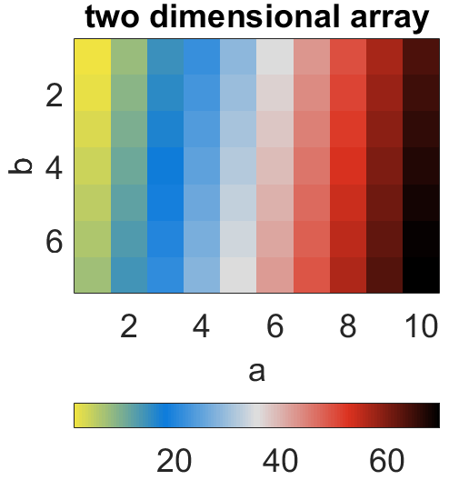
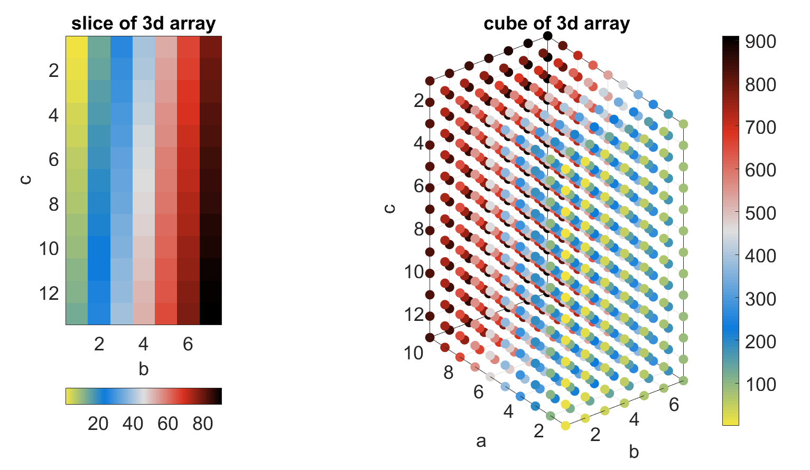
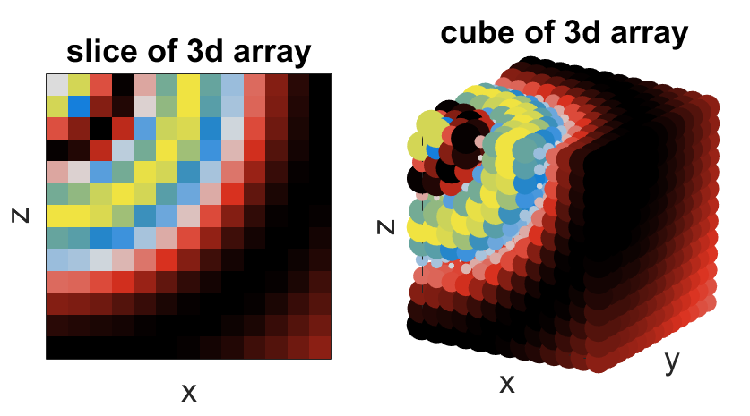

# ⬜ Build matrices in one for-loop
diego domenzain

July 2021 @ Aarhus University

## Code 📝

* ```matr_incep.m``` has examples on how to build a 2d and a 3d matrix in one for-loop.

3𝐝 · 𝐶 indexing
```matlab
for iabc = 0:na*nb*nc-1
  % get c coordinate
  ic = mod(iabc,nc);
  % iabc = ia*nb*nc + ib*nc + ic  ... (*)
  ibc = mod(iabc,nb*nc);
  % ibc = ib*nc + ic from (*)
  % get b coordinate
  ib = (ibc-ic)/nc;
  % get a coordinate from (*)
  ia = (iabc-ibc)/(nb*nc);
end
```

2𝐝 · 𝐶 indexing
```matlab
for iab = 0:na*nb-1
  % get b coordinate
  ib = mod(iab,nb);
  % iab = ia*nb + ib
  % get a coordinate
  ia = ((iab-ib)/nb);
end
```

## Example 🎨

[](./)

[](./)

[](./)

[](./)
