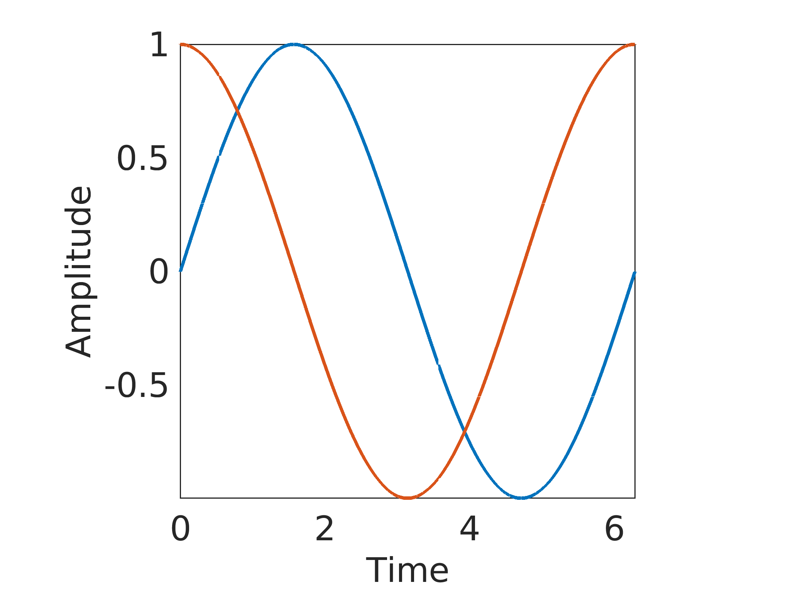

# 💻🚔

The script ```scripter.m``` is compiled with,

```matlab
>> mcc -d exe -e scripter.m
```

which saves it in ```exe/```.

The option ```-e``` is only for 💩. Otherwise use ```-m```.

By clicking on it, the output is ```../pics/somepic.png```.

You can also run it in *Power💩* with ```.\scripter.exe```.

[](./)

mcc -r exe/ffca9c9ez4i91.ico -d exe -e scripter.m
