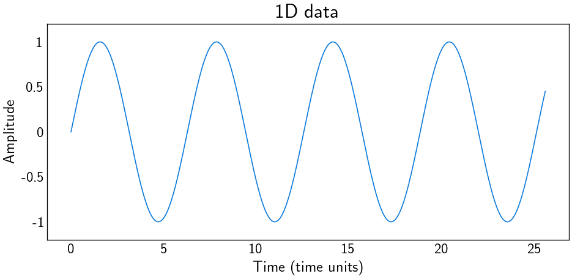

# Visualize 1D and 2D from *Fortran* data
diego domenzain
March 2021 @ Colorado School of Mines

## How to plot data from *Fortran* output

[](./)

__These scripts generate data, and then plot it.__

1. ```gen_data.f90``` generates data.
1. ```visualize_f.py``` visualizes it.

```shell
$> gen_data.sh
```

The file ```gen_data.f90``` writes everything as a big long vector.

*Python* follows the *C* convention of reshaping a matrix, so one must be careful!!

---

[](./)
