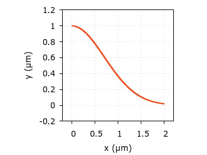
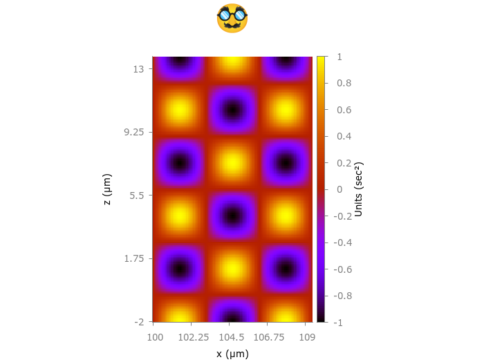

# 👁️ 📊️

diego domenzain

2023

---

Plot things in **``gnuplot``**.

🏃️

```shell
gnuplot filename.gnu
```

* ``viridis_colormap.gnu`` ⟶ ``imagesc(test_colormap.txt)``
* ``binplot.gnu`` ⟶  ``plot`` from binary file **written a la C!!**
* ``binimagesc.gnu`` ⟶  ``imagesc`` from binary file **with a weird format & float**
* ``binsubplot.gnu`` ⟶  ``subplot``

```text
a la C
 ____________
|            | ⟵ t
|____________| ⟵ s(t)


weird format & float (single precision)
   
 nx    M(ny,nx)
 ↓
 _______________
|_|_____________| ⟵ y
| |             |
| |             | ⟵ Mᵀ
|_|_____________|
 ↑
 x
```

---

## 📚️ manuals

* 🧑‍🏫️ 
 * https://gnuplot.sourceforge.net/demo_5.4/
 * http://www.gnuplot.info/docs_5.4/Gnuplot_5_4.pdf
 * http://www.gnuplotting.org/
* 🤞️ binary 
  * http://gnuplot.info/docs_6.0/loc7648.html
  * http://galileo.phys.virginia.edu/compfac/courses/geek-hours/gnuplot.html
* ◼️🟪️🟥️ colormaps
  * https://github.com/Gnuplotting/gnuplot-palettes

## 🎨️ art



