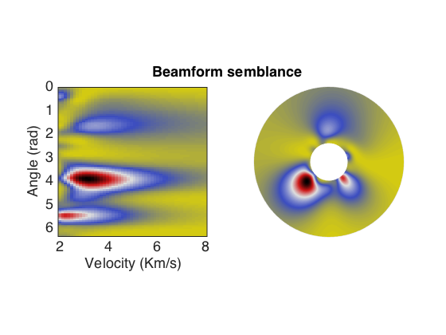

# Beamforming 
diego domenzain
September 2020 @ Colorado School of Mines

## Beamforming for velocity and direction estimation

Find the direction and velocity of an assumed planar wave from time-domain data of an array of receivers.

__This script is an example of a velocity vs angle semblance plot from field data of a receiver array.__

---

The data is from a passive seismic arrray.

Looking at the semblance, most of the energy comes from the south-west (approx 4 radians).

