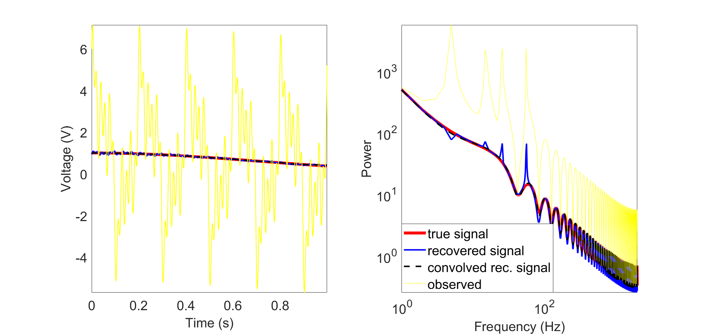

# 🎵 Harmonic denoising
diego domenzain

July 2021 @ Aarhus University

## Code 📝

* ```harmodenoi_synt.m``` synthetic example.
* ```harmodenoi_data.m``` example with field data.
* ```harmodenoi.m``` ready for production.

The main inversion routine is in ```src/hd_inversion.m```

## Fortran 💪

The *Fortran* version is always about **twice or three times faster** than the *Matlab* version:

* larger signal ⟶ *Fortran* is even faster.

In the terminal 💻,
```
cmd.exe "/K" '"C:\Program Files (x86)\Intel\oneAPI\setvars.bat" && powershell'
.\harmodenoi_synt.bat
.\harmodenoi_synt.exe
python3 .\vis\vis_sy.py
cd ..
```
or if you prefer to read and plot in *Matlab*,

```matlab
uo_sig = read_bin('bin\uo_sig',nt,'double');
uo_obs = read_bin('bin\uo_obs',nt,'double');
uo_reco= read_bin('bin\uo_reco',nt,'double');
figure;
hold on;
plot(t,uo_sig,'k')
plot(t,uo_obs,'b')
plot(t,uo_reco,'r--')
hold off;
legend({'Signal','Observed','Recovered'})
xlabel('Time (s)')
ylabel('Amplitude')
```

## Forward model 🌞

```
the forward model is,

uh(t) = Σj Σi αi⋅cos(2*π*t * fo*hj) + Σj Σi βi⋅sin(2*π*t * fo*hj)

which is linear on α and β, so we write it like so:

 uh = cos_blocs · α + sin_blocs · β

 the cos_blocs matrix (nt × nb·nh) looks like this:

                       nh
                       ↓
                    _____________________________
        |          |        |                    |
        |  nt_ →   |    *   |_________     0     |
        |          |________| ← nt__  |          |
 nt →   |          |        |    *    |          | · α
        |          |        |_________|          |
        |          |   0                  etc    |
        |          |_____________________________|

                                  ↑
                                nb·nh

and one cos_bloc looks like:

               nh
               ↓
            ________
           |        |
   nt_ →   |    *   | = cos( 2*pi*fo*t*h )
           |________|


each block is of size nt_ x nh.
they all overlap on nt__ samples.
this big matrix is of size nt x nb*nh.
there are nb = (nt-nt__)/(nt_-nt__) blocks.
α is of size nb*nh x 1.
```
The good thing about this matrix is that we do not have to store all of it in memory.

Instead, we directly compute each sub-block times its respective chunk of α.

## Inversion 🌚

We proceed by minimizing the function(s) Θ detailed in ```hd_obj.m```.

The inversion is done with gradient descent, where the gradient is of the form,

 g_ α= (∇_ α Θ) ⋅ *e*,

 where *e* is the *error* term (see ```hd_obj.m```).

Again, we do not store large matrices. Rather, we only compute the entries of ∇_ α Θ ⋅ *e*.

**example for the cosine part of (∇_fo Θ)**
```
cos( 2*pi*fo*t*h ) · α   ⟶   [-2·pi·t·h · sin(2·pi·fo·t·h)] · α
                        δ_fo

           nh
           ↓
        ________                _________      ________________
       |        |              |         |    |                |
nt_ →  |    *   | · α    ⟶    |-2·pi·t·h| ⊙ |sin(2·pi·fo·t·h)| · α
       |________|       δ_fo   |_________|    |________________|

```

### Observations 🌜🌛

  * In the case where there is only one block, this approach is still feasible because,
    * there is no explicit storage (and inversion) of large matrices.

  * Getting a very good solution for *fo* first is essential:
    * recovering α & β wont work if *fo* is not found first,
      * finding *fo* with the wrong α & β is not so hard.
    * For these reasons, *fo* is found first and then α & β.
      * The objective function for just *fo* is ln(sum( *e* ).^2).
      * The objective function for α & β is sum( *e* ).^2.
    * The code can handle inverting several *fo* for several blocks in time, but the results are honestly not any better.

## Example 🎨

[](./)
