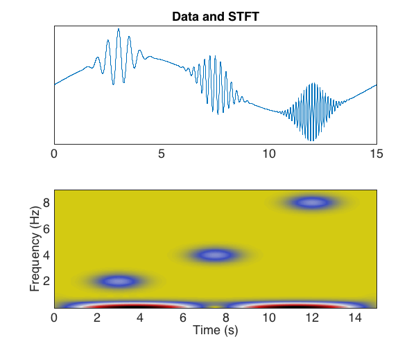

# 🎹 short time Fourier transform
diego domenzain
September 2020 @ Colorado School of Mines

## STFT

Find the frequencies that make up a signal at each time.

__This script is an example of finding the STFT of a signal.__

´´´matlab
% larger alpha -> narrower window
% larger width_ -> wider window

[stft_, gau_, fspect, tspect] = stft(wvlet, dt, t, alph, width_);

% 🎨

figure;
plot(t,wvlet)
axis square;
grid on;
xlabel('Time (sec)')
ylabel('Data (data)')

subplot(1,3,2)
fancy_imagesc(abs(stft_),t,fspect)
axis square;
xlabel('Time (t)')
ylabel('Frequency (1/t)')
title('Power (dB)')
simple_figure()

subplot(1,3,3)
fancy_imagesc(gau_.',t,tspect)
axis square;
ylabel('Time spectogram (t)')
xlabel('Time (t)')
title('Time window (data)')
simple_figure()
´´´

---

