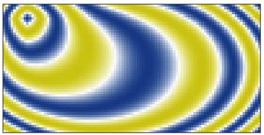

# :four_leaf_clover: alles

diego domenzain
2020

:house: __All small projects that need a place to live *but are not part of a large project*, live here.__

[](gallery/)

* Go to ```/gallery``` to see nice pictures ([link](gallery/)).
* Go to ```/projects``` to run projects.

If running *Matlab* projects, please set paths first by running the script:

```dir_paths.m```

---

## Content

* Optimization

  * [Gedanken of joint inversion](projects/opti/gedanken/)
  * [Gravity inversion](projects/opti/gravity/)
  * [Cross-gradient inversion](projects/opti/xgrad/)
  * Logistic regression
  * Snow slip
  * [Dense circle packing](projects/opti/dense-circ/)
  * [Markowitz portfolio](projects/opti/markowitz/)
  * Decision trees & Random forests
  * [Bayesian optimization](projects/opti/baye-opti/)
  * [Relative coordinates](projects/opti/rela-coords/))

* Dimensionality reduction

	* [Self-organizing maps](projects/dim-redu/self-org/)
	* t-SNE

* Graph theory algorithms

	* Spanning trees
	* [Dijkstra algorithm](projects/graph-alg/dijkstra/)
	* [Mesher](projects/graph-alg/mesher/)

* Partial differential equations

	* [Wave-advection](projects/pdes/wave-adv/)
	* [Elastic SV 2D (with CPML & free surface BC)](projects/pdes/elastic/)
	* [Heat equation](projects/pdes/heat/)
	* [Korteweg De Vries](projects/pdes/korteweg/)
	* [Eikonal solver](projects/pdes/eikonal/)
	* [Umfpack demo](projects/pdes/umfpack-demo/)
  * [Pardiso demo](projects/pdes/pardiso-demo/)
	* [Helmholtz-Hodge Decomposition](projects/pdes/hhd/)

* Squeezing and expanding matrices

	* Compressed sensing
	* Matrix completion
	* [Pixelating pics](projects/sque-exp/pixelate/) (for face-recognition-free profile pics)
	* [Haar wavelet compression](projects/sque-exp/haar/)
	* [Fast Fourier Transform](projects/sque-exp/fourier/)
	* [Big Mat](projects/sque-exp/bigmat-matlab/) (pass-by-reference in Matlab)

* Wave processing

	* MASW
	* FTAN
	* [STFT](projects/wave-proc/stft/)
	* Hyperbolic and linear semblance
	* [Beamforming](projects/wave-proc/beamforming/) (to find direction of signal)
	* Seismic beachball
  * [Harmonic denoising](projects/wave-proc/harmonic-denoising/)

* Cloud computing

	* Slurm
	* AWS
	* [OpenMP](projects/cloud/openmp/)

* Visualize

	* Plot output from *C*
	* [Plot output from *Fortran*](projects/visualize/see-fortran/)
	* Plot output from *Julia*
	* [*Fortran* in *Matlab*](projects/visualize/finmatlab/)
  * [Matrix inception](projects/visualize/matrix-inception/)

* Deep learning

	* [pic2pic](projects/deep-learning/pic2pic/). Smooth to rough squares

---

Some are written in *Matlab*, some in *C*, some in *Fortran*, some in *Julia*, some use *Python* packages.

Some were written by me, some I found in books (as exercises), some are a collage of stuff taken from the internet. Most are proof of concept by example.

__Not all are perfect but they all work. *They are toy examples*.__

---

[](gallery/)
