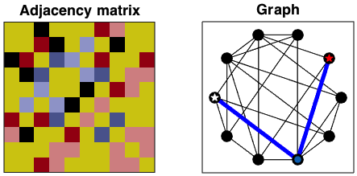

# alles

[](gallery/)

* Go to ```/gallery``` to see nice pictures ([link](gallery/)).
* Go to ```/projects``` to run projects.

If running Matlab projects, please set paths first by running the script:

```dir_paths.m```

---

All small projects that need a place to live - but are not part of a large project - live here.

* Optimization

	* Gedanken of joint inversion
	* Gravity inversion
	* Cross-gradient inversion
	* Logistic regression
	* Snow slip
	* Dense circle packing
	* Markowitz portfolio
	* Decision trees & Random forests

* Dimensionality reduction

	* Self-organizing maps
	* t-SNE

* Graph theory algorithms

	* Spanning trees
	* Dijkstra algorithm

* Partial differential equations

	* Wave-advection
	* Heat equation
	* Korteweg De Vries
	* Eikonal solver

* Squeezing and expanding matrices

	* Compressed sensing
	* Matrix completion
	* Pixelating pics (for face-recognition-free profile pics)

* Wave processing

	* MASW
	* FTAN
	* STFT
	* Hyperbolic and linear semblance
	* Beamforming (to find direction of signal)
	* Seismic beachball
	
* Cloud computing

	* Slurm
	* AWS
	
* Deep learning
	
	* pic2pic. Smooth to rough squares
	
---

Some are written in Matlab, some use Python packages.
Some were written by me, some are a collage of stuff taken from the iternet.
Most are proof of concept by example. 

__Not all are perfect but they all work.__

---

[](gallery/)
